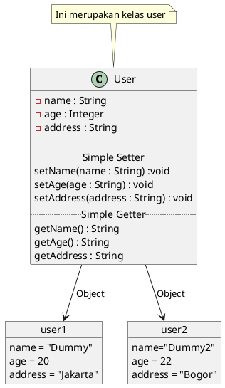

##  Java OOP (Object Oriented Programming)

#Introduction OOP
Pemrograman Berorientasi Object atau disingkat OOP merupakan paradigma pemrograman berdasarkan konsep objek yang berisi attribut atau field serta method atau function.

Dalam paradigma ini semua data dan method dibungkus dalam kelas kelas atau objek objek.

## Definisi
1. Class merupakan blueprint atau prototype dari objek yang akan kita buat. Di dalam class kiat mendeklarasikan properti dan method yang akan digunakan dalam objek kita
2. Object merupakan instance dari class yang memiliki state dan behavior

## Diagram Class

